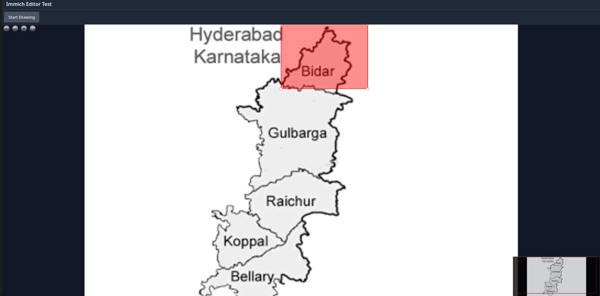

# Immich Image Annotation Tool

A React-based web application for viewing and annotating images from Immich with OpenSeadragon and Annotorious.

## Current Features

- Load and view high-resolution images from Immich
- Smooth zooming and panning with OpenSeadragon viewer
- Basic rectangular annotation support with Annotorious
- Drawing mode toggle
- Error boundary for graceful error handling
- Proxy server for secure communication with Immich API



## Prerequisites

- Node.js (v18 or higher recommended)
- NPM or Yarn
- Access to an Immich server
- Immich API key

## Setup

1. Clone the repository
2. Install dependencies:
```bash
npm install
```

3. Create a `.env` file in the root directory with your Immich API key:
```env
VITE_API_KEY=your_api_key_here
```

4. Start the development servers:

Terminal 1 (Proxy Server):
```bash
node server.js
```

Terminal 2 (Vite Dev Server):
```bash
npm run dev
```

## Usage

1. Access the application at `http://localhost:5173`
2. Add an asset ID to the URL: `http://localhost:5173?id=your_asset_id`
3. Use the "Start Drawing" button to enable annotation mode
4. Click and drag to create rectangular annotations

## Project Structure

```
├── src/
│   ├── components/
│   │   ├── ErrorBoundary.jsx
│   │   └── ImageViewer.jsx
│   ├── App.jsx
│   └── main.jsx
├── server.js
└── vite.config.js
```

## Technology Stack

- React 18
- Vite
- OpenSeadragon
- Annotorious
- Express (proxy server)
- Tailwind CSS

## Configuration

### Proxy Server (server.js)
- Port: 3000
- Handles communication with Immich API
- Manages CORS and authentication

### Vite Config
- Port: 5173
- Proxy configuration for API requests
- React plugin setup

## Limitations

Currently, the application:
- Only supports rectangular annotations
- Does not persist annotations
- Has no metadata editing capabilities
- Limited to viewing and basic annotation functionality

## Development Notes

The application is built with a proxy server architecture to handle API key security and CORS issues. The front end communicates with the proxy server, which then forwards authenticated requests to the Immich server.

## Error Handling

The application includes a global error boundary component that catches and displays React errors in a user-friendly manner.

## Future Development

Planned features include:
- Polygon annotation support
- Annotation metadata editing
- XML sidecar file integration
- Metadata sidebar
- Custom annotation popups
- Support for archival vocabularies

## Contributing

This project is in active development. Issues and pull requests are welcome.